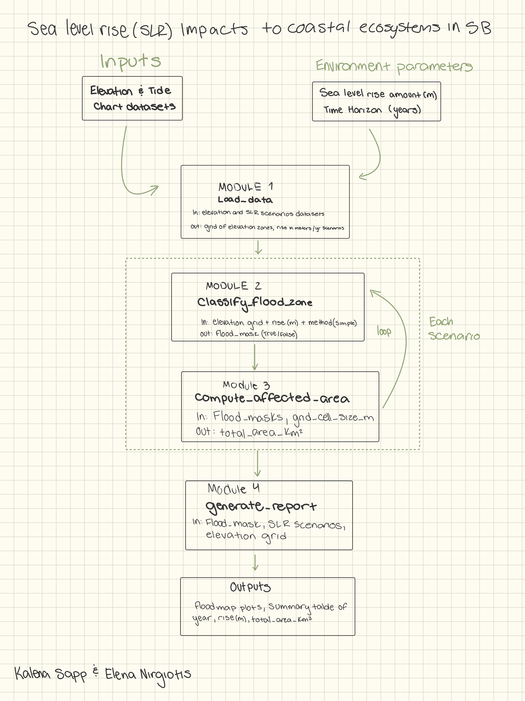
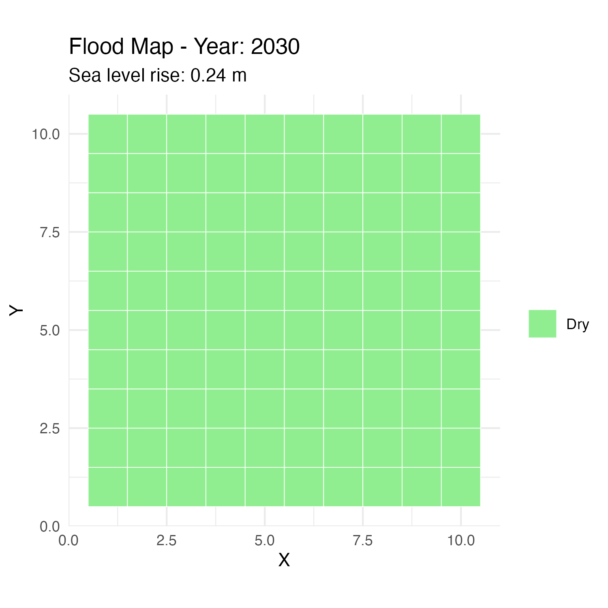
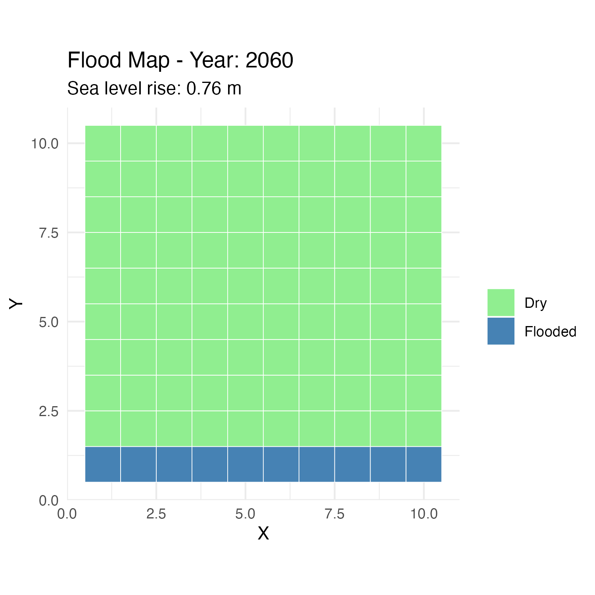
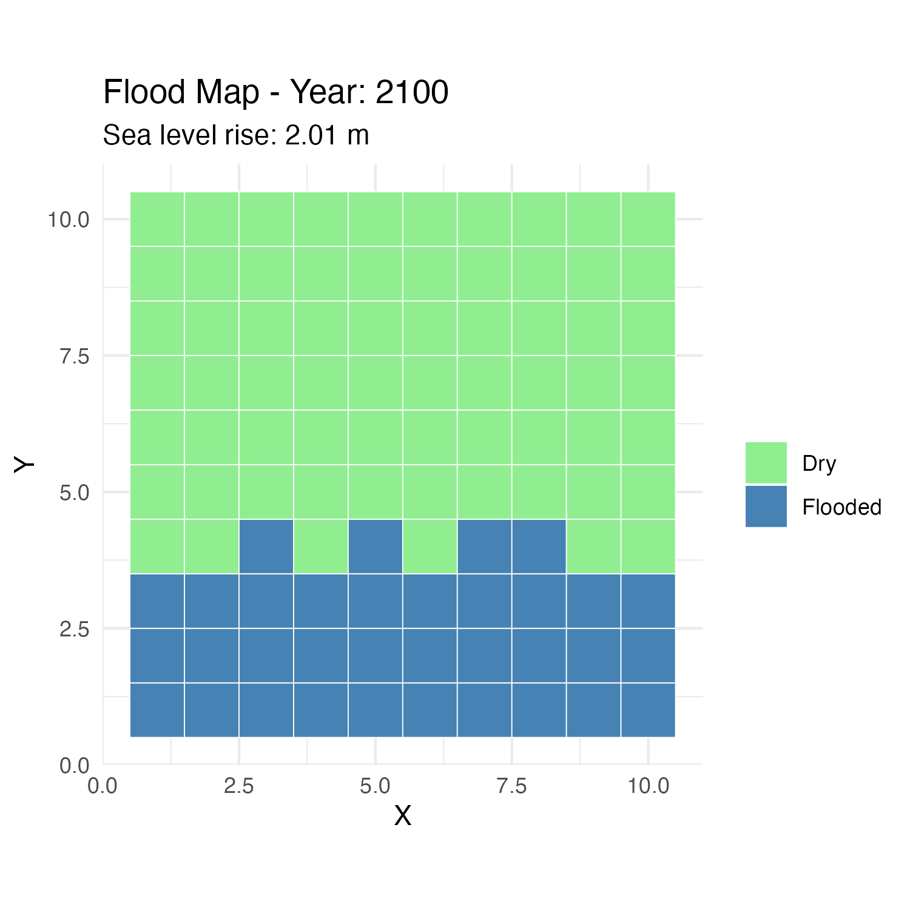

## Overview

This program models the impacts of sea level rise (SLR) on coastal ecosystems in Santa Barbara using a modular approach. We used three SLR scenarios from the City of Santa Barbara Vulnerability Assessment, based on the 2018 California Ocean Protection Council Sea-Level Rise Guidance.

## Modules

Our program is made up of 4 modules:

-   load_data: Creates a simulated coastal elevation grid and loads real SLR scenarios
-   classify_flood_zone: Classifies each grid cell as flooded or dry for a given rise amount
-   compute_affected_area: Calculates the total flooded area in km²
-   generate_report: Produces flood map visualizations for each scenario

## Model Diagram
```{r}
#| message: false
#| warning: false
#| echo: false


```

```{r}
#| message: false
#| warning: false
library(here)
library(tidyverse)

source("main.R")
```

## Results

The summary table below shows the total flooded area for each scenario:

```{r}
#| message: false
print(summary_table)
```

## Flood Maps

The following maps show which areas flood under each scenario. Blue = flooded, Green = dry.

```{r}
#| message: false
#| warning: false



```

## Interpretation
Based on the results, by 2100, approximately 0.03 km² of coastline is projected to flood under the high-emission scenario, representing a X-fold increase from 2030

## Data Source

Sea-level rise scenarios sourced from the City of Santa Barbara Vulnerability Assessment, based on the California Ocean Protection Council (OPC) 2018 Sea-Level Rise Guidance: 0.8 ft by 2030, 2.5 ft by 2060, and 6.6 ft by 2100, converted to meters.
